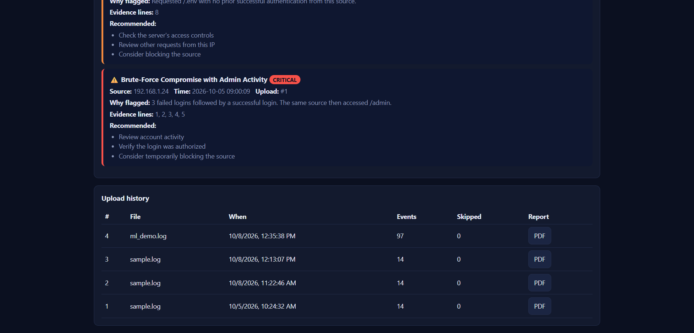

# CyberSentinel AI


An AI-assisted security log analysis platform. Upload authentication and server logs, and CyberSentinel parses them, detects suspicious behavior with both **explicit rules** and a **machine-learning anomaly detector**, assigns a risk level, **explains why** each source was flagged, and presents the results in a dashboard with downloadable PDF reports.

> Defensive and educational. It analyzes logs only. It contains no attack tooling and is evaluated on **synthetic data**.





[Sample PDF report](docs/sample-report.pdf)

## Features

- Log upload, parsing and normalization (bad lines are reported, never fatal)
- Rule-based detection: brute force, brute-force compromise, sensitive-path access without login, path enumeration
- ML anomaly detection (Isolation Forest + learned range guard) for behavior the rules cannot express
- LOW / MEDIUM / HIGH / CRITICAL severity, with a plain-English reason and evidence line numbers for every finding
- User accounts: Argon2 password hashing, JWT login, strict per-user data isolation
- Dashboard: statistics, severity chart, top source IPs, threat cards, search and filters, upload history
- PDF security report per upload
- Measured evaluation: precision, recall, F1, confusion matrices (below)

## Architecture

```
 Browser dashboard (HTML/JS)
        | REST + JWT
 FastAPI  -- auth, upload, findings, stats, PDF report
        |
 Parser -> Rule detectors ----+
        |                     +--> Findings (severity + reason + evidence) --> SQLite via SQLAlchemy
        +-> Features -> Isolation Forest + range guard (only IPs the rules did not flag)
```

| Layer | Choice |
|---|---|
| Backend | Python, FastAPI, Pydantic |
| Database | SQLite via SQLAlchemy (switch to PostgreSQL by changing `DATABASE_URL`) |
| ML | scikit-learn `IsolationForest`, NumPy |
| Auth | Argon2 (pwdlib), JWT (PyJWT) |
| Reports | ReportLab |
| Tests | pytest |

## Run it (Windows)

```
python -m venv .venv
.venv\Scripts\activate
pip install -r requirements.txt
copy .env.example .env
python -c "import secrets; print(secrets.token_hex(32))"
```

Paste the printed value into `.env` as `SECRET_KEY=...`, then train the model and start the server:

```
python backend\train_anomaly.py
cd backend
uvicorn app.main:app --reload
```

Open http://127.0.0.1:8000/dashboard/ (interactive API docs at `/docs`). Upload `data/synthetic/sample.log` or `data/synthetic/ml_demo.log`.
Run the tests from the project root with `pytest`. The server also works without a trained model (rules only).

## API

| Method | Path | Purpose |
|---|---|---|
| POST | `/auth/register`, `/auth/login` | Create account, get a token |
| GET | `/auth/me` | Current user |
| POST | `/analyze` | Upload a log file, detect threats, save results |
| GET | `/findings` | Your threats (`severity`, `q`, `limit` filters) |
| GET | `/uploads` | Your upload history |
| GET | `/uploads/{id}/report.pdf` | PDF report for one upload |
| GET | `/stats` | Totals, counts by severity, top source IPs |

## Security design

- Passwords are stored only as Argon2 hashes. Login takes similar time whether or not the email exists.
- Secrets live in `.env` (git-ignored). The app refuses to start without `SECRET_KEY`.
- Every data query is scoped to the logged-in user. Another user's upload returns `404`, the same as a missing one.
- Upload size is limited, files must be UTF-8, and all inputs are validated with Pydantic.
- Log content is untrusted: it is HTML-escaped in the dashboard and escaped before it reaches the PDF library.
- Saved model files are only loaded from a local path (joblib files can execute code if loaded from untrusted sources).
- Login throttling: failed attempts are stored in the database and limited per (email, IP) pair (5 per 15 minutes) and per IP (20 per 15 minutes). A locked client gets `429` with `Retry-After`, even with the right password. Limits apply to unknown emails too, so lockouts never reveal which accounts exist. 

## Machine learning and evaluation

**Protocol:** the experiment is repeated over 20 runs. Each run generates a new synthetic dataset (800 normal and 200 attack sessions), makes a new stratified 70/30 split, trains the model on normal training sessions only (with a new model seed) and scores every method on the 300 unseen sessions (240 normal, 60 attacks). Reproduce with `python backend\evaluate_seeds.py 20`. Cells show mean ± standard deviation [min–max] over the 20 runs.

| Method | Precision | Recall | F1 |
|---|---|---|---|
| Rules (count only) | 0.68 ± 0.04 [0.59–0.75] | 0.67 ± 0.06 [0.53–0.75] | 0.67 ± 0.04 [0.58–0.73] |
| Rules (with timing) | 0.99 ± 0.02 [0.93–1.00] | 0.67 ± 0.06 [0.53–0.75] | 0.79 ± 0.04 [0.69–0.86] |
| Isolation Forest only | 0.89 ± 0.03 [0.83–0.96] | 0.72 ± 0.10 [0.50–0.85] | 0.79 ± 0.07 [0.64–0.87] |
| ML (forest + range guard) | 0.91 ± 0.03 [0.87–0.97] | 0.98 ± 0.03 [0.90–1.00] | 0.95 ± 0.02 [0.89–0.98] |
| Rules (count) + ML | 0.74 ± 0.04 [0.66–0.81] | 1.00 ± 0.00 [1.00–1.00] | 0.85 ± 0.03 [0.79–0.90] |
| **Rules (timing) + ML (what the app runs)** | 0.91 ± 0.03 [0.87–0.95] | 1.00 ± 0.00 [1.00–1.00] | 0.95 ± 0.01 [0.93–0.98] |

Share of sessions flagged per session type (mean over the 20 runs; for attack types higher is better, for normal types lower is better):

| Session type | Attack? | Rules (count) | Rules (timing) | Forest | ML (full) | Rules (count) + ML | Rules (timing) + ML |
|---|---|---|---|---|---|---|---|
| admin_user | no | 0.01 | 0.01 | 0.02 | 0.02 | 0.02 | 0.02 |
| forgetful_user | no | 1.00 | 0.02 | 0.16 | 0.16 | 1.00 | 0.18 |
| heavy_user | no | 0.00 | 0.00 | 0.07 | 0.07 | 0.07 | 0.07 |
| typical_user | no | 0.00 | 0.00 | 0.00 | 0.00 | 0.00 | 0.00 |
| brute_force | yes | 1.00 | 1.00 | 1.00 | 1.00 | 1.00 | 1.00 |
| brute_no_success | yes | 1.00 | 1.00 | 1.00 | 1.00 | 1.00 | 1.00 |
| bulk_access | yes | 0.00 | 0.00 | 0.75 | 1.00 | 1.00 | 1.00 |
| post_login_abuse | yes | 0.00 | 0.00 | 0.05 | 1.00 | 1.00 | 1.00 |
| scanner | yes | 1.00 | 1.00 | 0.75 | 1.00 | 1.00 | 1.00 |
| sensitive_probe | yes | 1.00 | 1.00 | 0.76 | 0.87 | 1.00 | 1.00 |

**Findings**

- **Timing-aware rules are a robust improvement.** Requiring 3 failures within 60 seconds (or 5 or more at any speed) cut the share of forgetful users flagged by the rules from 100% to 2%. The combined system's F1 rose from 0.85 [0.79–0.90] to 0.95 [0.93–0.98]; the ranges do not overlap, so the worst timing-aware run beat the best count-only run.
- **Rules and ML fail in different places.** Rules never flagged the two attack types that use valid credentials (`bulk_access`, `post_login_abuse`), while ML flagged both in every run. ML alone flagged only 87% of `sensitive_probe`, which the rules always catch. With 60 attacks per test set, a combined recall of 1.00 in every run means no attack in these data was missed in any run.
- **The range guard is needed.** The forest alone had recall 0.72 [0.50–0.85] and flagged `bulk_access` and `scanner` sessions only 75% of the time; adding the guard raised recall to 0.98 and `bulk_access` to 100%. A single early run had suggested the forest alone handled bulk access; repeating the experiment corrected that.
- **Adding rules to ML does not improve F1 on these data** (0.95 ± 0.02 for ML alone versus 0.95 ± 0.01 combined, ranges overlapping). The combination's benefit is steadier recall (1.00 versus 0.98 ± 0.03, with ML alone falling to 0.90 in its worst run) at the same precision, plus explicit, auditable rules for the patterns they cover.
- **Remaining false alarms come from the ML model:** about 16–18% of forgetful users, 7% of heavy users and 2% of admins.
- Rules and ML fail in different places. Rules cannot see attackers with valid credentials (`bulk_access`, `post_login_abuse`: 0 of 21). ML catches both but missed one `sensitive_probe` that the rules caught. Together they missed none of these test attacks.
- **Timing fixed the rules' biggest weakness.** The count-only rule flagged all 26 forgetful users. Requiring 3 failures within 60 seconds (or 5 or more failures at any speed) cut that to 1 with no attack lost. Precision of the combined system rose from 0.69 to 0.82.
- All remaining false alarms (12 forgetful users and 1 heavy user) come from the ML model, which has no timing features yet.

**Limitations (honest)**

- All data is synthetic and generated by a hand-designed generator. Repeating the experiment 20 times shows the results are stable across data sampling and model randomness; it does not show they generalize to real traffic, because every dataset shares the generator's assumptions (for example, that forgetful users retry slowly and attackers fast).
- The rules, features and model were developed while looking at these same attack types, so the results are optimistic. Unseen attack types would be the real test.
- The 60-second window, the 5-failure threshold and the range-guard margin (1.25) were chosen by hand, not tuned on a separate validation set. An attacker who tries only 3–4 passwords slowly would now evade the brute-force rule.
- Per-type percentages rest on about ten test sessions per attack type per run, so they are coarse even after averaging.
- Detection operates per source IP; there is no IP-reputation data. ML findings are fixed at MEDIUM severity and are leads to investigate, not confirmed attacks.
- All data is synthetic and designed by the author. In particular, forgetful users were generated as slow and attackers as fast, so the timing result shows the method works under that assumption, not that real traffic behaves this way.
- The 60-second window and 5-failure threshold were chosen by hand and would need tuning on real logs. An attacker who tries only 3-4 passwords slowly would now evade the brute-force rule.
- One train/test split with one seed; no confidence intervals.
- The range guard's margin (1.25) was not tuned on a separate validation set.
- Detection is per source IP; there is no IP-reputation data yet.
- ML findings are fixed at MEDIUM severity and are leads to investigate, not confirmed attacks.
- Login throttling uses the connecting IP address. Behind a reverse proxy every user shares the proxy's IP unless trusted-proxy handling is configured, and a distributed attack (many IPs against one account) is not throttled per account.

## AI-written summaries (optional)

Detection never uses an LLM. After the rules and ML have produced findings, an optional step asks an LLM to turn them into a short plain-English overview for non-experts.

- Works without any API key: it falls back to a template summary, and also falls back if the API call fails.
- The model receives only structured findings (severity, title, source IP, reason), not raw log lines. Text that originated in the logs is stripped of control characters and truncated, and the instructions tell the model to treat it as data (prompt-injection mitigation).
- Hallucination guard: a summary that mentions an IP address not present in the findings is rejected.
- Summaries are labelled "AI-written", stored once per upload, and can never change a severity or detection.
- Privacy: IP addresses and finding text are sent to a third-party API when a key is configured. Use synthetic or authorized data only.

## Supported log formats

Detected line by line, so one file can mix them. All timestamps are normalized to `YYYY-MM-DD HH:MM:SS` (web logs are converted to UTC).

| Format | Example | What becomes an event |
|---|---|---|
| Simple (project format) | `[2026-10-05 09:00:01] 192.168.1.24 - FAILED LOGIN` | Failed login, successful login, or page access |
| SSH syslog (`auth.log`) | `Oct  5 09:00:01 web1 sshd[811]: Failed password for root from 203.0.113.5 port 22 ssh2` | `Failed ...` is a failed login and `Accepted ...` a successful one; other sshd lines are ignored |
| Web access log (Apache/nginx combined) | `203.0.113.50 - - [05/Oct/2026:09:10:00 +0000] "GET /.env HTTP/1.1" 404 153 "-" "curl/8.0"` | Each request is a page access (query string removed, percent-decoded once, lowercased, static assets ignored). A `POST` to a login path with 401/403 is a failed login, and 2xx/3xx a successful one |

Limitations: classic syslog has no year, so the current year is assumed (year boundaries are not handled); only IPv4 sources are analysed; the web login detection is a heuristic based on a list of login paths and cannot see failed logins that return `200` (some CMSs do this); behind a proxy or CDN the logged IP may belong to the proxy; and the ML model was trained on synthetic sessions, so on real web traffic (crawlers, shared IPs) its findings will be noisier than the evaluation suggests.

## Threat model

**What is protected:** user accounts and password hashes; the JWT signing key (`SECRET_KEY`); uploaded log data and the findings derived from it (IP addresses and request paths); optional third-party API keys.

**Who is assumed to attack:** (1) anonymous internet clients; (2) a registered user trying to read another user's data; (3) whoever controls the text inside an uploaded log (log content is untrusted); (4) someone who obtains a copy of the database or the repository.

| Threat | Mitigation in this project | Residual risk |
|---|---|---|
| Password guessing against the app's own login | Argon2 hashing; failed attempts are stored in the database and limited per (email, IP) and per IP within 15 minutes; locked clients get `429` even with the right password; unknown emails are throttled and answered identically; constant-time-style dummy hash check | Distributed attacks across many IPs; clients behind a shared proxy IP; no MFA |
| Stolen database | Only Argon2 password hashes are stored | Findings and log-derived data are stored unencrypted |
| Token theft or forgery | HS256 JWT signed with a secret from the environment; tokens expire (60 minutes by default) | Token lives in `sessionStorage`, so an XSS bug could expose it; no revocation or refresh; HTTPS must be provided by the deployment |
| Reading another user's data | Every query is scoped to the logged-in user; another user's upload returns `404`; covered by tests | Relies on every new endpoint following the same pattern |
| Malicious log content (XSS, PDF markup, prompt injection) | HTML escaping in the dashboard; text escaped before reaching the PDF library; the optional LLM receives only structured findings, with log-derived text cleaned and truncated, and summaries mentioning unknown IPs are rejected | A model can still write a misleading summary (it is labelled "AI-written") |
| Resource exhaustion through uploads | 2 MB upload cap, UTF-8 only, input validation | No per-user quota and no general API rate limiting |
| Secret leakage | `.env` is git-ignored; `.env.example` holds placeholders; the app refuses to start without `SECRET_KEY`; CI needs no secrets | Repository history was checked by hand, not by an automated scanner |
| Vulnerable dependencies | CI installs from `requirements.txt` on every push | No automated dependency scanning |
| Evading or poisoning the ML model | The model is trained offline on synthetic data only, never on uploads | An attacker who stays inside the learned "normal" range evades it; the range-guard margin is hand-tuned |

**Out of scope:** TLS termination and network defenses, multi-factor authentication, account recovery, per-user quotas, security headers such as CSP, and data-retention or deletion features. IP addresses can be personal data, so use synthetic or properly authorized logs only.

**Assumptions:** the app is deployed behind HTTPS, `SECRET_KEY` and database credentials stay private, and the app is used by a small number of trusted-but-not-fully-trusted users.

**Misuse:** CyberSentinel only analyzes log text. It sends no traffic and scans nothing.

## Roadmap

- [x] Parser, rule engine, tests
- [x] FastAPI + database, authentication, dashboard
- [x] ML anomaly detection with evaluation
- [x] PDF reports
- [X] Timing features (failure rate, events per minute) to separate forgetful users from attacks
- [ ] IP reputation lookups via a legitimate API
- [ ] Docker, then cloud deployment
- [X] Migrations (Alembic) and PostgreSQL

Database and migrations. The app uses SQLite by default. To use PostgreSQL, set DATABASE_URL to a PostgreSQL URL (tested on Neon). The schema is managed with Alembic: run cd backend then alembic upgrade head to create or update it. After changing app/orm.py, generate a migration with alembic revision --autogenerate -m "describe change".

## Responsible use

For defensive analysis and learning only. Use synthetic or properly authorized data. Detections are estimates and should be verified by a person before any action is taken.

## “Not currently hosted. Run locally with the steps below.”